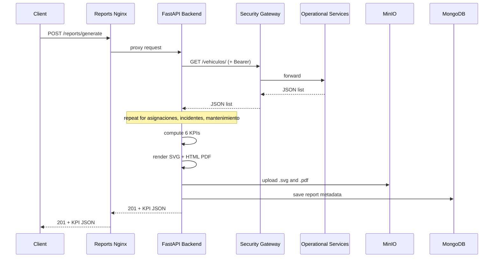

# Report Generation Flow

End-to-end sequence from client request to stored artifacts.

## High-level sequence



## Step-by-step

### 1. Request validation

- Entry: `POST /reports/generate` (or `/api/reports/generate` via Security Gateway proxy)
- Validated fields: `report_id`, `title`, `start_date`, `end_date`, optional `sede_operacion`
- Inbound JWT is enforced on protected routes; `/health` and `/metrics` remain public
- Security Gateway validates RBAC before forwarding requests to `/api/reports/**`

### 2. Operational data collection

The `GenerateReportUseCase` performs **four parallel sequential GETs** through the Security Gateway:

1. `/vehiculos/`
2. `/asignaciones/`
3. `/incidentes/`
4. `/mantenimiento/`

Each call uses the configured bearer token and a dedicated circuit breaker. Transport errors may open the breaker; HTTP error responses fail the use case immediately.

### 3. KPI computation

Domain application services derive exactly **six KPIs**:

| Order | Service | Input data |
|-------|---------|------------|
| 1 | `AvailabilityService` | Vehicles |
| 2 | `MaintenanceService` | Maintenance (MTTR) |
| 3 | `IncidentService` | Incidents + maintenance + vehicles |
| 4 | `IncidentService` | Incidents (severity rate) |
| 5 | `IncidentService` | Incidents (human rate) |
| 6 | `IncidentService` | Incidents (recurrence) |

Assignments are retrieved but not yet used in KPI formulas (reserved for future traceability features).

### 4. Artifact generation

`ReportService.generate()` orchestrates:

1. **GraphService** — builds an SVG chart from KPI names/values
2. **ObjectStorage** — uploads SVG to `MINIO_GRAPHS_BUCKET`
3. **TemplateService** — builds Jinja2 context (KPIs + presigned graph URL)
4. **WeasyPrint renderer** — HTML template → PDF bytes
5. **ObjectStorage** — uploads PDF to `MINIO_REPORTS_BUCKET`
6. **AnalyticsRepository** — persists report entity to MongoDB

### 5. Response

- HTTP **201 Created**
- Body includes `status: "generated"`, `document_url` (PDF object key), and all six KPIs

---

## Alternative entry: Security Gateway proxy

When accessed through the FleetOps Security Gateway:

```text
Client → Security Gateway :8000/api/reports/generate
       → Reports :8080/api/reports/generate (alias)
       → same backend flow as above
```

Operational data reads still go **outbound** from Reports to the Security Gateway (`/vehiculos/`, etc.), not through the inbound `/reportes` route.

---

## Failure modes

| Condition | HTTP | Detail code |
|-----------|------|-------------|
| Upstream unreachable / circuit open | 422 | `REPORT_GENERATION_ERROR` |
| Invalid upstream JSON shape | 422 | `REPORT_GENERATION_ERROR` |
| Missing or expired JWT (upstream) | 422 | `REPORT_GENERATION_ERROR` |
| Domain rule violation | 422 | Domain error payload |
| MinIO / MongoDB / PDF render failure | 422 | Wrapped exception message |

A healthy `GET /health` response does **not** guarantee successful report generation. Upstream availability and JWT validity must also hold.

---

## Observability touchpoints

| Signal | Location |
|--------|----------|
| Liveness | `GET /health` |
| Prometheus counters/histograms | `GET /metrics` |
| Structured logs | `LOG_FILE_PATH` (when configured; scraped by Promtail in dev) |
| Grafana dashboards | Dev stack on `GRAFANA_HTTP_PORT` |

---

## Quick validation

```bash
# 1. Stack healthy
curl http://localhost:8080/health

# 2. Generate report (requires Security Gateway + token in .env)
curl -X POST http://localhost:8080/reports/generate \
  -H "Content-Type: application/json" \
  -d '{"report_id":"rep-flow-001","title":"Flow Test","start_date":"2026-05-01","end_date":"2026-05-31"}'
```

For full local integration setup, see [../simulate/02-local-integration.md](../simulate/02-local-integration.md).
